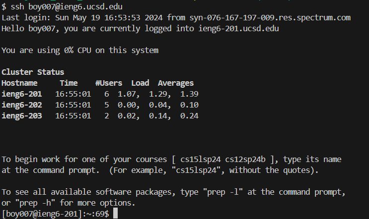
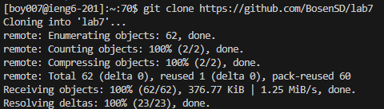
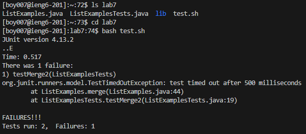
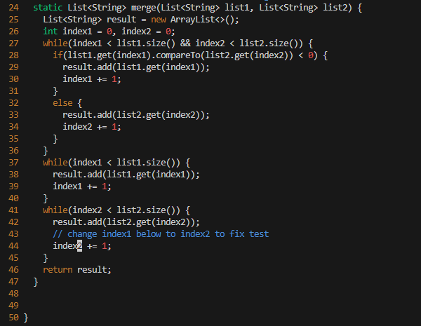
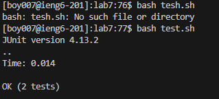
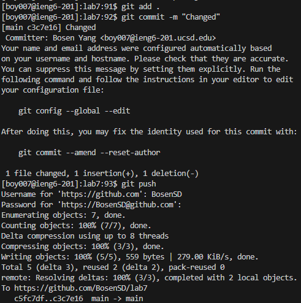

## Step 4: Log into ieng6

**key pressed:** 

`ssh<space>boy007@ieng6.ucsd.edu<enter>`

**summary:** 

`ssh` with the server authenticates my rsa key in my device and takes me into the server

## Step 5: Clone your fork of the repository from your Github account (using the SSH URL)

**key pressed:** 

`git<space>clone<space>https://github.com/BosenSD/lab7<enter>`

**summary:** 

`git clone` takes my `https://github.com/BosenSD/lab7<enter>` git repository and clone it into the my account on ieng6 server.

## Step 6: Run the tests, demonstrating that they fail

**key pressed:** 

`cd<space>lab7<enter>` 

`bash<space>tesh.sh<enter>`

**summary:**

`cd lab7` change my directory into lab7

I use `bash` command executing bash code in `test.sh` file. This file compile my java files and run them. One of the tests failed.

## Step 7: Edit the code file to fix the failing test

**key pressed:** 

`vim<space>ListExamples.java` 

`:set<space>nu<enter>44gger2:wq<enter>`

**summary:**

I first use `vim` command taking `ListExamples.java` file. This can make me edit this file using vim commands

Then, I come into the vim editor interface. `:set<space>nu<enter>` key presses first shows the line numbers in the interface. After that, `44gg` key presses move my cursor to the 44th line. Now my cursor is a the starting of `index1` in the file. Then, `e` move my cursor to the end of `index1`, so my cursor is now on `1`. `r2` replace `1` with `2`. Finally, `:wq<enter>` save the changes I made and exit the vim editor.

## Step 8: Run the tests, demonstrating that they now succeed

**key pressed:** 

`bash<space>test.sh<enter>`

**summary:**

This step is similar to step 6. I use `bash` command executing bash code in `test.sh` file. This file compile my java files and run them. This time all tests passed.

## Step 9: Commit and push the resulting change to your Github account (you can pick any commit message!)

**key pressed:** 

`git<space>add<space>.<enter>` 

`git<space>commit<space>-m<space>"Changed"<enter>` 

`git<space>push<enter>` 

(fillig Username and Token_code)

**summary:** 

`git add .` command allow me to add all the changes in all files from my current directory.

`git commit -m "Changed"` command commit the changes to the repository. Also, it adds add message for my commitment

`git push` command push the changes on my github repository.

